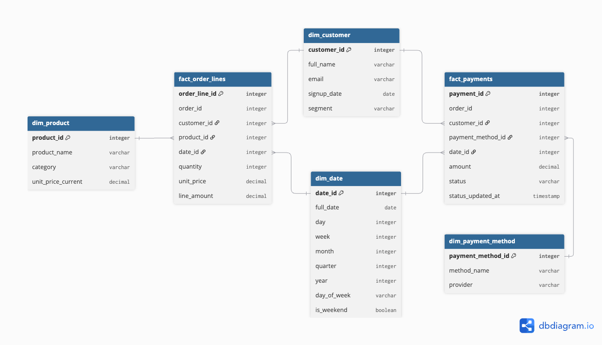

# Answer 2 — Data Modeling

## Question

You are designing a simple analytics data model for an online store. The business wants to answer these questions:

- What is total revenue by day?
- What are the top-selling products each week?
- How many orders does each customer place?
- What is the payment success rate?

**Available business objects:**

- customers
- products
- orders
- payments

**Please answer in this format:**

1. What tables would you create?
2. What would be the grain of your main fact table?
3. Why would you include or not include an order_items table?
4. What problems would happen if product information were stored directly inside the orders table?

## Answer

### 1. Tables



```
dim_customer
  customer_id (PK)
  full_name
  email
  signup_date

dim_product
  product_id (PK)
  product_name
  category
  unit_price

dim_date
  date_id (PK)
  full_date
  day
  week

dim_payment_method
  payment_method_id (PK)
  method_name              -- card, bank_transfer, wallet, cash_on_delivery, ...

fact_order_lines
  order_line_id (PK)       -- surrogate key = hash/concat(order_id, product_id)
  order_id                 -- degenerate dim, groups lines of the same order
  customer_id  FK -> dim_customer
  product_id   FK -> dim_product
  date_id      FK -> dim_date       -- order date
  quantity
  unit_price                        -- price at time of sale (snapshot, not from dim_product)
  line_amount                       -- quantity * unit_price

fact_payments
  payment_id (PK)
  order_id                  -- degenerate dim, same order_id, no FK to fact_order_lines
  customer_id    FK -> dim_customer
  payment_method_id FK -> dim_payment_method
  date_id        FK -> dim_date     -- payment date
  amount                    -- order total charged
  status                    -- pending / success / failed
  status_updated_at
```

**Why this design:**
- Payment is its own fact, not a dimension, because status changes over time (pending → success/failed) — that's event behavior, not a fixed attribute.
- `fact_order_lines` (order item line), not order-level, because 1 order can hold many products with different quantities — order-level grain can't represent that without arrays/repeated columns.
- Each dim/fact included is either a key needed to join, or holds data one of the 4 questions or a measure (`line_amount`, `amount`) needs — nothing added speculatively.


### 2. Grain of the fact tables

This design has two fact tables, each at its own grain — they're not merged into one because order lines and payments don't share a 1:1 relationship (one order can have many lines, but each order has one payment record whose status changes over time).

**`fact_order_lines`** — one row per order line = one product within one order:

```
order_id | line_id | product_id | quantity | unit_price | line_amount
1001     | 1       | A          | 2        | 15         | 30
1001     | 2       | B          | 1        | 20         | 20
```

This is the smallest useful grain: an order can contain many products each with its own quantity, so order-level grain would lose per-product detail (breaking "top-selling products"). There's no finer grain available in the source data.

**`fact_payments`** — one row per payment attempt (retries create new rows, same `order_id`):

```
payment_id | order_id | amount | status  | status_updated_at
5001       | 1001     | 50     | failed  | 2026-09-20 10:01
5002       | 1001     | 50     | pending | 2026-09-20 10:02
5003       | 1001     | 50     | success | 2026-09-20 10:03
```

Same `order_id` can appear more than once — each retry is a new `payment_id` row (grain = one row per payment attempt, not per order). This is why `order_id` can't be the payment table's primary key.

How each business question maps to this design:

| Question | Query shape |
|---|---|
| Revenue by day | `SUM(amount)` from `fact_payments` (filtered `status='success'`) joined to `dim_date`, grouped by day |
| Top products/week | `SUM(quantity)` from `fact_order_lines`, grouped by week + `product_id`, ordered desc |
| Orders per customer | `COUNT(DISTINCT order_id)` from `fact_order_lines` grouped by `customer_id` |
| Payment success rate | `COUNT(status='success') / COUNT(*)` from `fact_payments` |

### 3. Why include an order_items table (here, `fact_order_lines`)

Because 1 order can contain many products, each with its own quantity. Without it, an order-grain fact would need to cram a list of (product, quantity) pairs into one row, which SQL can't aggregate cleanly (can't sum quantity per product, can't filter by product). Splitting into one row per order line makes both order-level and product-level aggregation trivial.

### 4. Problems with storing product info directly inside the orders table

- Denormalization/duplication: product name, price, etc. repeated on every order row — wastes space and risks inconsistency if a product's details change.
- Update anomalies: renaming a product means updating every historical order row instead of one row in `dim_product`.
- Loses history: if price is only stored on the product (not the order line), you can't tell what the customer actually paid at purchase time — the fact table needs its own `unit_price`/`line_amount` snapshot at the time of sale.
